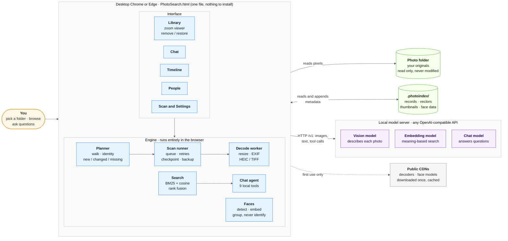

# PhotoSearch

**Search and browse your own photo library in plain English, entirely on your own machine.**

One HTML file. No install, no server, no build step, no cloud.

PhotoSearch scans a folder of photos with a local vision model, builds a searchable index
next to the photos, and lets you browse it or talk to it:

> *"photos of children in a forest"* · *"anything from summer 2021"* · *"where was the one
> with the boat taken?"*

It works with **any local server that speaks the OpenAI API**: [LM Studio](https://lmstudio.ai),
[Ollama](https://ollama.com), llama.cpp's server, vLLM and LocalAI. You point it at a URL and
pick your models; nothing is specific to one product.



**Reading the diagram.** Everything inside the grey box runs in your browser tab. The
interface drives the engine; the engine reads your photos (read only), reads and appends to the
index, and is the only part that talks to the model server (images and text while scanning,
tool calls while chatting). The CDN is touched once, the first time a decoder or face model is
needed. Where each piece of data lives is spelled out in
[Where your photos and data live](#where-your-photos-and-data-live).

The current version is shown in the app's footer; the [ChangeLog](ChangeLog.md) says what changed and when.

## Index
<!-- index:start -->
- [At a glance](#at-a-glance)
- [Quick start](#quick-start)
  - [1. Start a model server](#1-start-a-model-server)
  - [2. Open the app](#2-open-the-app)
  - [3. Connect, then scan](#3-connect-then-scan)
- [Using the app](#using-the-app)
  - [Explore: one set of photos, four lenses](#explore-one-set-of-photos-four-lenses)
  - [Searching](#searching)
  - [⌘K](#k)
  - [Links](#links)
- [How it works](#how-it-works)
- [Where your photos and data live](#where-your-photos-and-data-live)
- [Principles](#principles)
- [Models and structured output](#models-and-structured-output)
- [What it costs](#what-it-costs)
- [Requirements](#requirements)
- [FAQ](#faq)
- [Documentation](#documentation)
- [Status and roadmap](#status-and-roadmap)
- [License](#license)
<!-- index:end -->

## At a glance

| | |
|---|---|
| **Describes every photo** | caption, description, objects, activities, scene, visible text (OCR), date, camera, GPS and place |
| **Finds anything** | a Photos-style search field with instant suggestions for people, places, dates, kinds of picture and things in the picture, plus keyword and semantic search merged together and exact `"phrases"` |
| **Browses like a photo app** | a zoomable Library grid, a full-window viewer, a day-by-day Timeline |
| **Talks to your library** | a chat agent with nine tools that answers with the matching photos |
| **Groups faces, never identifies them** | people appear as anonymous groups until *you* name them |
| **Tidies safely** | favourite, rotate or remove photos from the Library, with undo; your files are never touched |
| **Survives reality** | resumable scans, flaky-network-share tolerance, verified backups, a built-in self-test |
| **Stays private** | no accounts, no API keys, no telemetry, no photo ever uploaded |

[↑ Back to Index](#index)

---

## Quick start

You need a **vision model** (to describe photos) and ideally an **embedding model** (for
meaning-based search). Use whichever server you already have.

### 1. Start a model server

**LM Studio**

1. Download a vision model (`Qwen3.5-VL` is the reference; any VLM works) and an embedding
   model such as `nomic-embed-text`.
2. **Start the server with CORS enabled.** This is the step people miss:
   ```bash
   lms server start --cors --port 1234
   ```
   Or in the app: *Developer* tab → Status **Running** → tick **Enable CORS**.
3. The URL for Settings is `http://localhost:1234`.

**Ollama**

1. Pull a vision model and an embedding model:
   ```bash
   ollama pull qwen2.5vl        # or llava, minicpm-v, moondream, llama3.2-vision
   ollama pull nomic-embed-text
   ```
2. **Allow this page to talk to it.** A page opened from a file sends `Origin: null`, which
   Ollama rejects by default:
   ```bash
   OLLAMA_ORIGINS='*' ollama serve
   ```
   If Ollama runs as the macOS menu-bar app, use `launchctl setenv OLLAMA_ORIGINS '*'` and
   restart it.
3. The URL for Settings is `http://localhost:11434`.

Other servers (llama.cpp, vLLM, LocalAI) are listed in [docs/SETUP.md](docs/SETUP.md).

### 2. Open the app

Double-click **`PhotoSearch.html`** in desktop Chrome or Edge. `file://` is fine; no web server
is needed.

### 3. Connect, then scan

1. *Settings* → **Test connection**. It reports the server it found, the models, and whether
   the server can enforce a JSON schema (see [Models and structured output](#models-and-structured-output)).
2. *Settings* → **Choose folder**, and pick your photos.
3. *Scan* tab → **Refresh plan** → **Scan**.
4. Open the **Library** tab and browse while it works. Newest photos are scanned first, so the
   index is useful on day one.

Detail on every step, including running the server on another machine and troubleshooting, is
in **[docs/SETUP.md](docs/SETUP.md)**.

[↑ Back to Index](#index)

---

## Using the app

**Three tabs, split by what you are doing.**

| tab | what it is for |
|---|---|
| **Explore** | Looking at, finding and organising your photos. Everything that is a *way of looking* is a lens here, so you never have to go somewhere else and start again. |
| **Scan** | Building and maintaining the index, in three sections: **Photos** (the plan — what is new, changed, failed or missing — progress and retry), **Faces** (find faces, improve from originals, the model and source pickers) and **Maintenance** (rebuild thumbnails, compact the log, back up, move the index). The rail beside them always shows which index, which folder, how many records and when it last ran. |
| **Settings** | Five sections behind a rail: **Connection** (server, models, roles), **Library** (photo folder, index location, scope, exclusions), **Scanning** (concurrency, tokens, dates, places, events), **Privacy & data** (what is stored about faces, how to delete it, backup preferences) and **Diagnostics** (self-test, thinking-off probe). |

### Explore: one set of photos, four lenses

The segmented control picks **how the photos are arranged**; the dropdown beside it picks
**which photos**. Changing the lens never loses your place: your scope, your search, your
selection and your scroll position all survive.

| lens | what it shows |
|---|---|
| **Grid** | Every photo in one grid. The **Size** slider changes density. Click a photo and it grows out of its tile into a full-window viewer: `←` `→` step through, `R` rotates right, `Shift+R` rotates left, `I` shows details, `Esc` closes. **Select** enables multi-select (click, shift-click for a range, `⌘/Ctrl+A`); the rotate buttons turn the whole selection and **Remove** hides it. |
| **Timeline** | The same photos by day, newest first, with places and occasions in the headings, a year bar and a date picker. |
| **People** | The face groups. Name them, merge and split them; names then work in search and chat. Clicking a named person searches for them in the Grid. |

**Chat** is a drawer, not a lens: the **Chat** button on the right of the lens bar slides it
over from the side (`Esc` closes it). Ask in plain language, and the photos in the answer
**appear in the grid behind** — so you can close the drawer and open them, step through them,
select them or regroup them by date. It also shows which tools the model used.


**Scope** — *All photos*, *Favourites*, *Removed* — applies to the Grid and the Timeline.
Click the ♡ that appears on a photo (or press `F` in the viewer) to favourite it; in Select
mode the **Favourite** button hearts the whole selection. *Removed* lists what you hid, so you
can restore it; removing never deletes a file.

### Searching

The field in the toolbar (press `/` or `Ctrl/⌘+K` to jump to it) **narrows whatever lens you
are in** rather than taking you anywhere. Search in the Grid, switch to Timeline, and the same
results are there grouped by day.

Click it and you see your people; type and you get suggestions grouped as **People** (with
their face), **Dates** (`2021`, `june`, `june 2021`, occasions such as Easter), **Places**,
**Kinds of picture** (screenshots, documents) and **In the picture** (`boat`, `cake`,
`forest`). Pick one and it becomes a token inside the field; keep picking to narrow further,
such as *Anna* + *Sicily* + *2022*. `Backspace` on an empty field removes the last token, and
`+` or `,` finishes a word. Several people at once can be typed as `mum + dad` (or `&`, `,`,
`and`); the results are photos with all of them. Press Enter on the first row to search the
words themselves by keyword and meaning.

It also takes plain words and `"exact phrases"` in quotes. And you can type the filters:

| type this | to |
|---|---|
| `-screenshot` | leave photos with that word out |
| `-Anna` | leave that person out |
| `place:Sicily` | narrow by place |
| `2019..2021` | narrow by date (`2019-06..2019-08` and full dates work too) |

**Filters** beside the scope dropdown opens the same things as boxes — From and To dates,
Place, *Recognise names in my search*, *Include meaning-based matches* — with a count beside
the button so you can always see that filters are set. Clearing the search clears them too.

### ⌘K

`Cmd/Ctrl+K` opens a command palette: start typing and it offers every lens, scope, section and
action by name — *timeline*, *favourites*, *find faces*, *rebuild thumbnails*, *back up now*,
*delete all face data* — along with everyone you have named. Pick one and it takes you there and
does it. Anything that matches no command is offered as a photo search instead. `/` still jumps
to the search field.

### Links

Every view has its own address, so you can bookmark or share one:
`PhotoSearch.html#explore`, `#explore/timeline`, `#explore/people`, `#scan`, `#scan/faces`,
`#settings` or `#settings/privacy`. Opening a link goes straight there, choosing a tab or lens updates the
address, and Back and Forward step through where you have been. Older links — `#library`,
`#favourites`, `#search`, `#timeline`, `#people`, `#chat` — all still work. (`#selftest` is
reserved for the self-test.)

[↑ Back to Index](#index)

---

## How it works

1. **Scan.** PhotoSearch walks the folder and decodes each image in a Web Worker. It asks the
   vision model to fill a fixed JSON schema (observations first, caption last, "unknown"
   preferred over a guess), reads EXIF for dates, camera and GPS, and resolves GPS to place
   names from an offline GeoNames extract.
2. **Index.** Everything is written to `.photoindex/` beside your photos: one JSON line per
   photo, a float32 embedding file and 384px thumbnails. It is plain text you can `grep`.
3. **Search.** BM25 over an inverted index and cosine similarity over the embeddings are merged
   with reciprocal rank fusion. It all happens in the browser; there is no vector database.
4. **Chat.** A tool-calling agent runs nine tools over the index locally. The model sees only
   small summaries, never the index itself. Models without tool support fall back to
   retrieve-then-answer automatically.
5. **Faces.** Detection and recognition run in the browser, with no server involved. Faces are
   clustered by resemblance and stay anonymous until named.

The full design is in **[docs/ARCHITECTURE.md](docs/ARCHITECTURE.md)**.

[↑ Back to Index](#index)

---

## Where your photos and data live

PhotoSearch keeps three things strictly apart: your **photos**, the **metadata** it derives
from them, and the app's own **settings**.

```
 YOUR PHOTO FOLDER                      THE INDEX  (.photoindex/)             THE BROWSER
 e.g. /Volumes/Photos/                  beside the photos by default,         (this Chrome profile)
                                        or a folder you choose
   2021/IMG_0001.jpg   ── read only ─▶    records.jsonl   metadata            settings, plus a
   2021/IMG_0002.heic                     vectors.bin     embeddings          remembered pointer
   trip/IMG_0100.jpg                      thumbs/         384px previews      to each folder
                                          faces/          face data
   never copied, moved,                   backups/ geo/   copies, place names
   edited or deleted
```

| what | where it lives | what is in it |
|---|---|---|
| **Your photos** | where they already are, untouched | the only copy of the full-size pixels |
| **Metadata** (the index) | `.photoindex/`: beside the photos by default, or a folder you pick in Settings | captions, descriptions, objects, visible text, dates and where each date came from, camera, GPS and place name, embeddings, a content fingerprint, and the path back to each photo |
| **Derived images** | inside the index | a 384px thumbnail per photo, and small aligned face crops. Thumbnails are never rewritten when you rotate; the angle is stored beside the metadata |
| **Settings** | the browser's own storage | server URL, model choices, scan options, Library size, and *pointers* to your last photo and index folders (not copies of anything) |
| **The model server** | its own process, usually on your machine | receives a resized 1024px copy of each photo while it is scanned, and your chat questions; the app asks it to keep nothing |
| **Downloaded helpers** | a public CDN, kept in the browser's cache | HEIC/TIFF decoders and the face models; place names go into `geo/` in the index |

**How the two halves connect.** Each metadata record names its photo by relative path and by a
content fingerprint, and holds no full-size pixels. The Library, Timeline, search and chat
all work from the index alone. Only when you open a photo full-size does the app read the
original from your folder; if the folder is not connected, it shows the thumbnail instead.

**What follows from that**

- Deleting `.photoindex/` leaves every photo untouched, but you lose the scan (about 21.5
  seconds of model time per photo), so back it up. See
  [docs/OPERATIONS.md](docs/OPERATIONS.md#backing-up-by-hand).
- Moving or renaming photos does not lose their metadata; photos are matched by content, not
  only by path.
- Removing a photo in the Library only flags its record as hidden, and rotating one only stores
  an angle on its record. The file stays put either way.
- Keeping the index on a local disk while the photos live on a NAS means browsing and
  search keep working while the NAS is asleep.
- Chrome forgets folder access when the page reloads, so you re-approve the photo folder; the
  index is not affected.

Every file in the index is described in [docs/ARCHITECTURE.md](docs/ARCHITECTURE.md#where-data-lives).

[↑ Back to Index](#index)

---

## Principles

**Nothing about your photos leaves your computer.** No accounts, no API keys, no telemetry.
The app talks only to the model server you point it at (by default on your own machine). A few
public libraries and models are *downloaded* once and cached when first needed: image decoders
for HEIC and TIFF, the face-recognition model, and the place-name list. Nothing is uploaded.

**Your files are never modified.** The app writes only inside `.photoindex/`. "Remove" means
"hide from the index" and "Rotate" means "display it turned"; the photo stays exactly where it
is, byte for byte, and both are undoable. Because rotation is a display setting, other apps
will still show the original orientation.

**People are grouped, never identified.** The extraction prompt forbids naming people or
guessing ethnicity, religion or health, and describes them only by age group, clothing and
action. Face grouping works the same way: it clusters faces that *look alike*, and every name
comes from you. Age, gender and emotion estimates are discarded at the boundary, and a test
asserts they never reach storage. This is a deliberate divergence from commercial photo
managers.

**The index is plain text.** `records.jsonl` is one JSON object per line. There is no
proprietary format and no lock-in.

**Photos are identified by content, not by path.** Scan a subfolder today and the whole library
tomorrow: one index either way, no duplicates, nothing wrongly marked missing.

**EXIF dates are not trusted blindly.** Exported and AI-generated files routinely carry the
*processing* time in every date field. Records store `date_source` and `date_confidence`, and
flag `date_suspect` when a date has no camera tags behind it.

**One file.** `PhotoSearch.html` is about 530 KB with everything inline. Copy it to any machine
and it works. The source lives in `src/` and is assembled by `build.py`; see
[CONTRIBUTING.md](CONTRIBUTING.md).

[↑ Back to Index](#index)

---

## Models and structured output

If your server reports model types (LM Studio) or families (Ollama), the right models are
detected automatically. Otherwise types are guessed from the name, and you can correct them
under *Settings → Model roles*; the dropdowns list every model, so one that was not recognised
can always be chosen by hand.

| role | what it is for | examples |
|---|---|---|
| **Scan (vision)** | describing every photo | Qwen3.5-VL, Gemma 3, llava, minicpm-v, moondream, Pixtral |
| **Embeddings** | meaning-based search | nomic-embed-text, bge-m3, mxbai-embed-large |
| **Chat agent** | answering questions over the index | any decent instruct model |

Set the embedding model **before** the first big scan, since adding one later means
re-embedding every record. Without one, search is keyword-only.

**Why structured output matters.** This is the one place where servers genuinely differ, so
**Test connection** probes it and tells you which of three contracts you have:

| what your server supports | what happens |
|---|---|
| **JSON schema** (LM Studio, recent Ollama, vLLM) | Best. Constrained decoding also stops a reasoning model thinking out loud: **13 output tokens instead of 799** on the same prompt. |
| **JSON only**, no schema | Works, with more tokens, more repair and occasional retries. |
| **Neither** | Answers are parsed out of prose, and some photos will fail. |

Nothing needs configuring; the app detects the contract and adapts. The measurements and the
catch (including an OCR workaround) are in [docs/FINDINGS.md](docs/FINDINGS.md).

[↑ Back to Index](#index)

---

## What it costs

Measured on an M-series Mac with `Qwen3.5-9B` (MLX 4-bit) and 1024px input:

| | |
|---|---|
| **~21.5 s** | per photo, end to end |
| ~400 tokens | generated per photo |
| ~4,000 photos | per day, unattended |
| ~5 KB | index per photo (plus a 384px thumbnail) |

Concurrency does not help. Most local servers process one request at a time unless told
otherwise (LM Studio needs `--parallel`; Ollama needs `OLLAMA_NUM_PARALLEL`). Lowering the
input resolution barely helps either, because generation dominates. A 100,000-photo library is
a multi-week scan, so plan for it. Scans are resumable, and newest-first by default.

Face grouping is far cheaper because it needs no model call: about 8 minutes for 6,635 photos
from thumbnails.

[↑ Back to Index](#index)

---

## Requirements

- **Desktop Chrome or Edge.** The File System Access API has no equivalent in Firefox or
  Safari. The app detects this and says so rather than half-working.
  The page must also be on `https://` or `localhost`; opened over plain `http://` from another
  machine the folder picker is hidden. See [docs/SETUP.md](docs/SETUP.md#serving-it-to-other-machines).
- **A local server that speaks the OpenAI API**, with a vision model loaded and CORS allowed
  for this page.
- **An embedding model** (optional but recommended).
- **Nothing** for face grouping: the detector and recognition model run in the browser.

Formats: JPEG, PNG, WebP, GIF, BMP and AVIF natively; HEIC/HEIF via libheif; TIFF via UTIF.
RAW files (NEF, CR2, ARW, DNG and others) are read through the full-size JPEG preview the camera embeds in them, so you see the camera's rendering, not a RAW development; a RAW beside a same-named JPEG is not scanned twice. Video and vector files are counted and skipped.

[↑ Back to Index](#index)

---

## FAQ

**Does it upload my photos?** No. Photos are sent only to the model server you configure,
which is normally on your own machine.

**Does it change or delete my files?** No. It writes only to `.photoindex/`. Removing a photo in
the Library hides it from the index and can be undone.

**Does it recognise people?** It groups faces that look alike and shows them as "Group 1",
"Group 2" and so on. It never decides who anyone is; every name is typed by you.

**Can I use Ollama (or something other than LM Studio)?** Yes, any server that speaks the OpenAI
API. See [Quick start](#quick-start).

**Why does Test connection say "Failed to fetch"?** Almost always CORS: the app is a local file,
so the browser sends `Origin: null`, and servers reject that by default. The fix for each
server is in [docs/SETUP.md](docs/SETUP.md#choosing-a-server).

**How long will my library take?** About 21.5 seconds per photo on an M-series Mac. See
[What it costs](#what-it-costs).

**Can I stop and resume?** Yes. The plan is rebuilt from what is on disk, so you never start
from zero, even after a crash.

**Where is my data?** Photos stay where they are. The metadata is in `.photoindex/` beside the
photos, or a folder you choose in Settings. See [Where your photos and data live](#where-your-photos-and-data-live);
[docs/OPERATIONS.md](docs/OPERATIONS.md) lists every file and how to back it up by hand.

**It does not work in Firefox or Safari.** Correct; they lack the File System Access API.

[↑ Back to Index](#index)

---

## Documentation

| | |
|---|---|
| [SETUP.md](docs/SETUP.md) | Installing, CORS, Ollama, remote servers, troubleshooting |
| [ARCHITECTURE.md](docs/ARCHITECTURE.md) | How the index, search, Library and agent actually work |
| [FINDINGS.md](docs/FINDINGS.md) | Measured results, and server behaviour that cost time to find |
| [TESTING.md](docs/TESTING.md) | The self-test, and driving it headlessly |
| [OPERATIONS.md](docs/OPERATIONS.md) | Where every file lives, manual backup, slow-NAS notes |
| [ROADMAP.md](docs/ROADMAP.md) | What is built, what is missing next, and what each costs |
| [UI-REDESIGN.md](docs/UI-REDESIGN.md) | Eight tabs into three: Explore, Scan, Settings — with every control mapped |
| [ChangeLog.md](ChangeLog.md) | What changed in each version |
| [CONTRIBUTING.md](CONTRIBUTING.md) | Build, code style, how to propose changes |

[↑ Back to Index](#index)

---

## Status and roadmap

Working software, used daily against a multi-terabyte NAS library. Rough edges remain; see
[issues](../../issues).

Built so far: scanning, search, chat, Timeline, People, Library with a zoom viewer, remove and
restore, and support for any OpenAI-compatible server. Next up: a perceptual hash for
near-duplicates, smarter query parsing, video, and a map view. The full list, with costs and
risks, is in [docs/ROADMAP.md](docs/ROADMAP.md).

Contributions are welcome: **[CONTRIBUTING.md](CONTRIBUTING.md)**.

[↑ Back to Index](#index)

---

## License

MIT, see [LICENSE](LICENSE).

[↑ Back to Index](#index)
